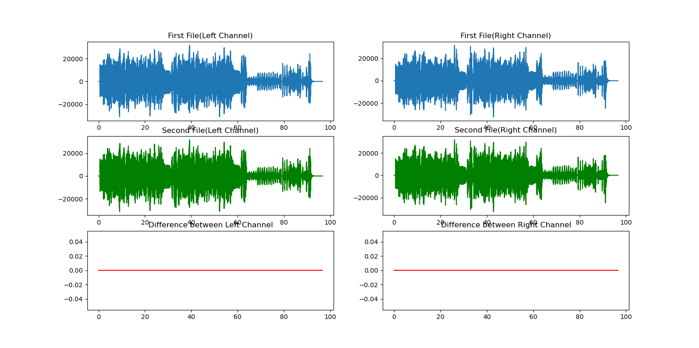
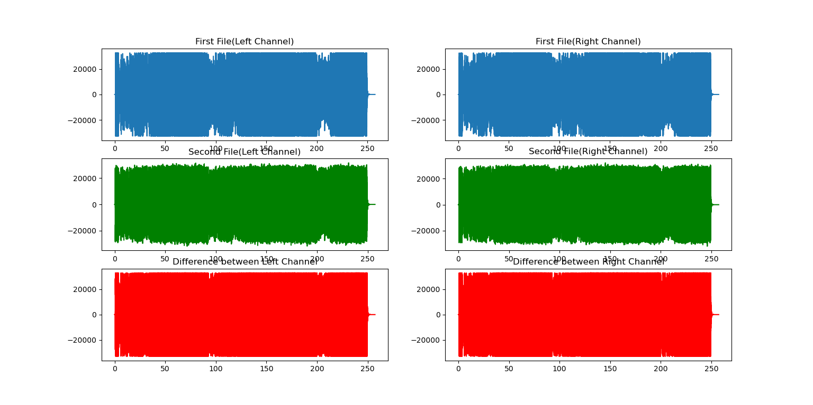

# WaveCompare
Compare the difference between WAV audio files.  
比较两个WAV文件音频数据（不含元数据）的差异。
## 用途示例
* 比较经过压缩的flac文件数据是否与原始wav文件一致
* 比较各个来源获取的同一首歌音频数据是否一致
* etc.

注意：比较的两个音频文件都需要转换成wav格式
## 使用方法
运行Python脚本，按照提示输入两个wav文件的路径即可，程序会绘制出两个wav文件左右声道的波形以及对两个左声道作差和两个右声道作差的波形。

观察下方红色折线图，如果折线图为直线且值为0说明音频数据一致，否则不一致。

## 注意事项
* 比较的两个音频文件都需要转换成wav格式
* 此工具仅用于验证音频数据是否一致，不能作为评价音质好坏的标准，对音频做延时等处理都会导致音频数据不一致
* 此工具暂时只支持双声道音频
